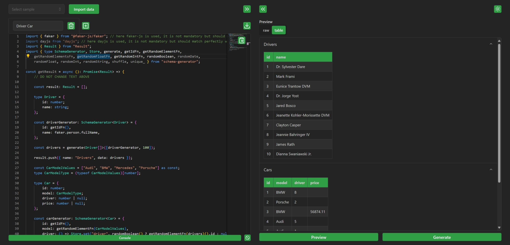
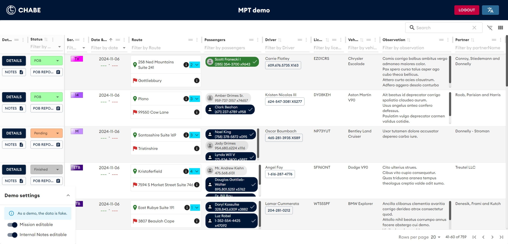
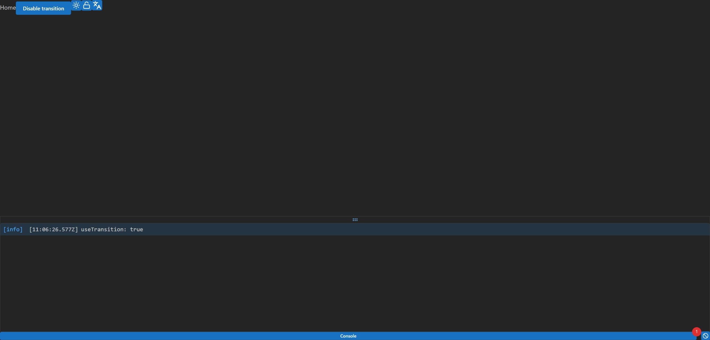
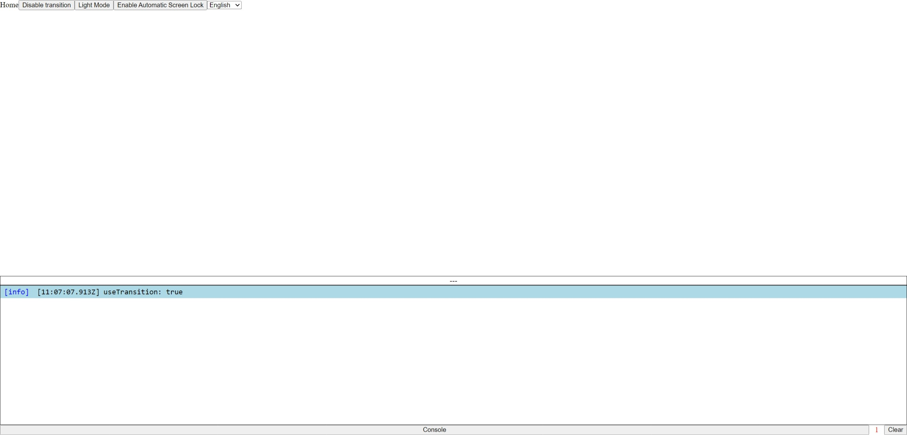

Hello,

I'm a software engineer, full stack developer.  
I use to program in C++, TypeScript/JavaScript, React.

### Schema Generator

[SchemaGenerator](https://github.com/nicolasventer/SchemaGenerator) is a TypeScript/JavaScript library for generating mock data through a schema.

This library does not have any dependencies but it is recommended to use it with [faker.js](https://fakerjs.dev/) for more realistic data.

#### [Try it online](https://nicolasventer.github.io/SchemaGenerator/)

### MPT-Demo

[MPT-Demo](https://github.com/nicolasventer/MPT-Demo) is a demo of the MPT project.

#### [Try it online](https://nicolasventer.github.io/MPT-Demo/)

### Preact Project Template

[Preact-Project-Template](https://github.com/nicolasventer/Preact-Project-Template) is a template for a Preact project that can either be used as a standalone client or as a client + server.

There are 4 versions, each version corresponding to `Preact`/`React` `Full`/`Light` Template.

|  |  |
| :-----------------------------------------------------------------------------: | :-------------------------------------------------------------------------------: |
|                                      Full                                       |                                       Light                                       |

#### [Try it online](https://nicolasventer.github.io/Preact-Project-Template/)

### Other projects

- libraries
  - [File Watcher](https://github.com/nicolasventer/File-Watcher) - c++ library that allows you to watch a folder and get notified of any file changes inside.
  - [Interruptible Sleep](https://github.com/nicolasventer/Interruptible-Sleep) - c++ library that allows you to sleep for a specified amount of time and interrupt the sleep at any time.
- tools
  - [raw ts](https://github.com/nicolasventer/raw-ts) - executable that convert a file to a raw TypeScript string.
- misc
  - [GDB-cheat-sheet](https://github.com/nicolasventer/GDB-cheat-sheet) - cheat sheet for GDB.
  - [Coding standard](https://github.com/nicolasventer/Cpp-Coding-Standard) - Personal C++ Coding Standard.
